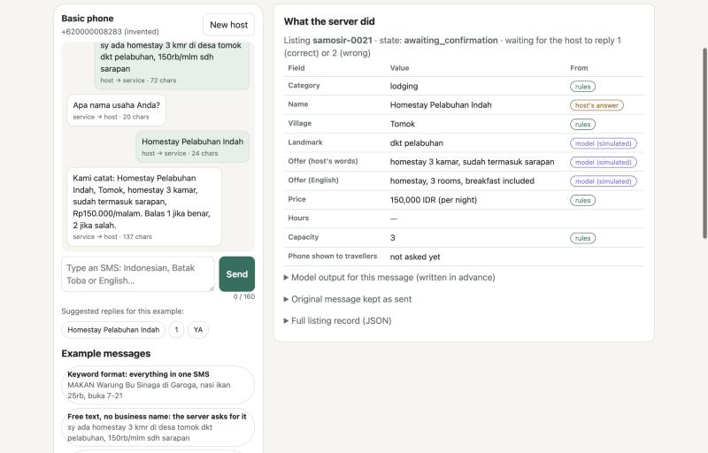
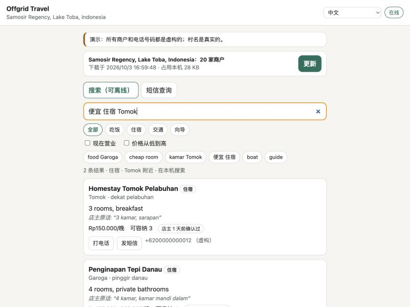
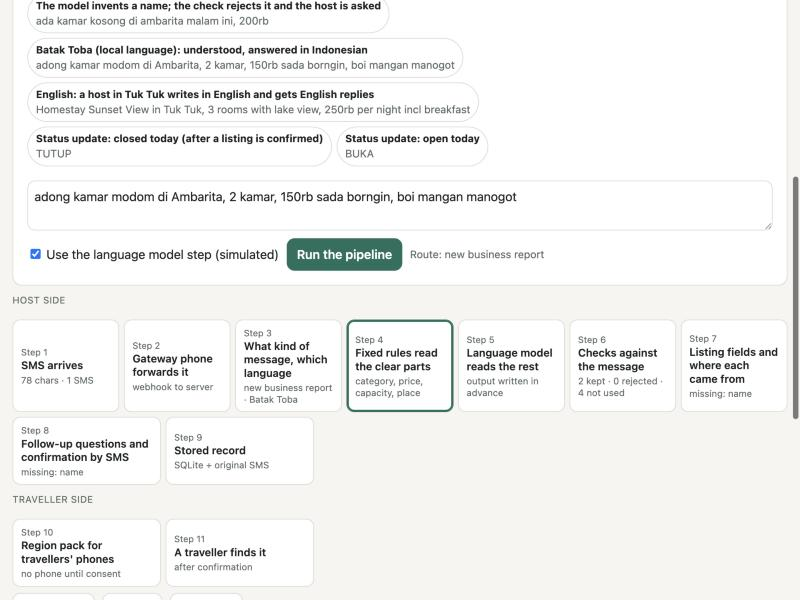
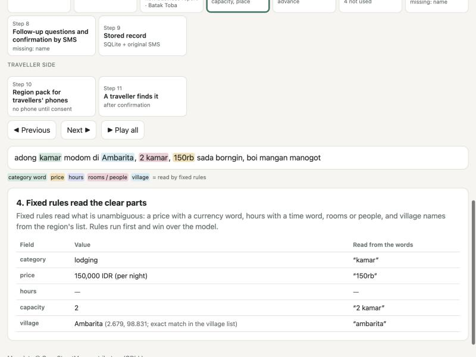

# Offgrid Tourism

中文版：[README.zh.md](README.zh.md)

Local food and lodging information for places with weak connectivity. Small businesses report what they offer **by SMS from any phone, in their own language**. Travellers **search the listings on their phone with no connection**, or ask by SMS when they have signal but no data.

Built for the World Bank **Small AI for Development** hackathon, tourism track (3–4 October 2026).

**Live demo:** https://offgrid-tourism.vercel.app (permanent, on Vercel). The host demo and the SMS simulator keep conversations, so they run on our own server; `/host` on Vercel forwards there (https://emotions-auburn-carried-divide.trycloudflare.com, a temporary address that changes when that server restarts).

| Page | What it shows |
|---|---|
| [`/pipeline`](https://offgrid-tourism.vercel.app/pipeline) | One SMS followed through every step of the pipeline, computed live by the server |
| [`/host`](https://offgrid-tourism.vercel.app/host) | The host side: a basic phone, and what the server did with each message |
| [`/app/`](https://offgrid-tourism.vercel.app/app/) | The traveller app: download once, then search offline; or ask by SMS |

> **Demo data.** Every business, price and phone number is invented; village names are real (OpenStreetMap). **No language model runs in the demo**: for the example messages, the model's output was written in advance, and the pages say so wherever it appears. Any other message is handled by fixed rules and follow-up questions only.

## The problem

Small guesthouses, food stalls, boat operators and guides outside the main tourist centres are often missing from maps and booking sites, and their owners may only have a basic phone. Travellers who go there cannot find out where to eat or sleep, and the money they would spend locally goes elsewhere or is not spent.

Measured on OpenStreetMap for our test region, Samosir Regency on Lake Toba, Indonesia (snapshot 2026-10-03, `scripts/osm_gap.py`):

| Measure | Value |
|---|---|
| Food and lodging places listed | 228 |
| …of which within 3 km of Tuk Tuk, the main tourist village | 141 (62%) |
| …with a phone or WhatsApp number | 17 (7%) |
| …with opening hours | 12 (5%) |
| Villages with no listed food or lodging within 2 km | 76 of 132 (58%) |

A village with zero places in OpenStreetMap has no public record; it does not mean the village has no food or lodging. That missing record is what this project fills. Details and sources: [docs/REAL_WORLD_DATA.md](docs/REAL_WORLD_DATA.md).

## What it does

**Hosts (local businesses)** text one message, for example `MAKAN Warung Bu Sinaga di Garoga, nasi ikan 25rb, buka 7-21` ("FOOD Warung Bu Sinaga in Garoga, rice and fish 25k, open 7–21"). The server turns it into a structured listing, asks one short SMS question for anything missing, sends back a summary to confirm with `1`, and asks whether the phone number may be shown to travellers. `BUKA` / `TUTUP` ("open" / "closed") mark today's status.

**Travellers** download the listings for a region while they have a connection (about 28 KB for the 20 demo listings), then search them on the phone with no connection: by category, village, "cheap", "open now". With signal but no data, they text `SEARCH food Garoga`, `CARI makan Garoga` or `搜索 吃 Garoga` and get the top three back by SMS. They can also ask in their own words (the Ask tab): online, the server answers from the listings; with signal but no data, the same question works by SMS; with no connection, a small language model downloaded to the phone (Qwen2.5-0.5B-Instruct, running in the browser) turns the question into a search.





## How the pipeline works

```
Host phone ──SMS──► Android phone with a SIM (SMS gateway app) ──webhook──► server
  server: 1 language + kind of message → 2 fixed rules → 3 language model (optional) → 4 checks
          → 5 follow-up questions by SMS → 6 host confirms → SQLite (with the original message)
          → region pack (JSON) ──download──► traveller app: offline search
traveller with signal but no data ──SMS──► same server ──SMS──► top 3 listings
traveller question in own words ──app or SMS──► server: rules pick listings → model answers from them → checks
traveller with no connection ──► small model on the phone: question → search filters → offline search
```

| Step | What happens | AI? |
|---|---|---|
| Language and kind of message | Word lists per language decide the language; fixed rules decide whether it is a report, a search, a status update or chit-chat | No |
| Fixed rules | Prices with a currency word (`25rb`, `Rp 25.000`, `1,5jt`), hours with a time word, rooms or people, village names from the region's list | No |
| Language model | Reads what rules cannot: business name, what is offered, directions, English translation | Yes (simulated in the demo) |
| Checks | A model value is kept only if it can be traced to the message: names must appear in it, numbers must match, villages must be in the list | No |
| Follow-up questions | One SMS question per missing field instead of a guess | No |
| Confirmation and consent | Host replies `1`; the phone number is shown only with consent | No |
| Region pack and search | Confirmed listings only; search runs on the phone | No |
| Traveller questions (app, SMS) | Rules pick candidate listings; the model answers from them only; the answer is kept only if every business it names is a cited candidate and it names nothing else | Yes (simulated in the demo) |
| Questions with no connection | A small model on the phone turns the question into search filters; the answer is built from the listing rows, so it cannot invent places | Yes (runs in the browser) |

The [`/pipeline`](https://offgrid-tourism.vercel.app/pipeline) page runs any message through these steps with the real server code and shows each step's output, without saving anything. One example shows the model inventing a business name and the check rejecting it.





The model is reached through one interface, so any provider can be plugged in by changing settings: any OpenAI-compatible server (Ollama, vLLM, llama.cpp, hosted APIs), the Anthropic API, `simulated`, or `none` (rules and follow-up questions only).

On the traveller's phone, the app can download Qwen2.5-0.5B-Instruct (Apache-2.0) from Hugging Face and run it in the browser with transformers.js: about 790 MB with a graphics chip (WebGPU), about 520 MB without (WebAssembly). It only outputs search filters as JSON, and questions answered on the phone never leave the phone. In our test on a Mac laptop it took about 1 second per question with the graphics chip and 3.5–8.6 seconds without.

## Languages

| Who | Languages in the Samosir profile | Replies in |
|---|---|---|
| Hosts | Indonesian, Batak Toba (the local language), English | The host's language; Batak Toba falls back to Indonesian, the national language |
| Travellers | English, Indonesian, Chinese | The traveller's language |

- Each message's language is decided by fixed rules from the region's word lists; Chinese is matched without spaces. The same lists drive commands, category words, price units and time words.
- A host's language is remembered, so follow-up questions stay in it.
- The traveller app's interface switches between English, Indonesian and Chinese. Listings show the host's own words when the reader shares the host's language, otherwise the English translation with the original below it.
- The Batak Toba words were written from general knowledge and **have not been checked by a native speaker**.

## Any region

Nothing about Samosir is in the code. Everything place-specific (languages and their word lists, currency and price shorthands, village list, reply texts, time zone) is in a region profile, [regions/samosir.json](regions/samosir.json). To add a region:

1. `python scripts/osm_gap.py --area-name "<name>" --admin-level <n>` downloads its villages and measures the gap.
2. Write `regions/<id>.json` with its languages, words and reply texts.
3. Start the server with `REGION_PROFILE=regions/<id>.json`.

## Run it

Python 3.10 or newer; no packages to install (standard library only).

```bash
cd server
python -m offgrid seed                                  # load the 20 invented listings
LLM_PROVIDER=simulated python -m offgrid serve          # http://127.0.0.1:8000
python -m unittest discover tests                       # 24 tests, no network
```

Deploying to a server, the settings, and connecting the Android SMS gateway phone: [docs/RUNBOOK.md](docs/RUNBOOK.md).

## Repository layout

```
server/offgrid/   HTTP server, rules, LLM interface, conversation, traveller questions, search, region pack, pipeline trace
server/offgrid/static/   landing page, host demo, pipeline walkthrough
server/tests/     end-to-end tests with the simulated model
mobile/pwa/       traveller app: offline web app with search, questions and an optional on-device model
regions/          one profile per region
models/           extraction prompt; simulated model outputs and examples for the demo
schemas/          JSON Schema for a listing
scripts/          osm_gap.py: OpenStreetMap gap measurement for any region
data/real/        OpenStreetMap extract for the test region (ODbL)
data/synthetic/   invented seed listings, labelled as such
deploy/           deploy.sh: copy to a server over SSH, start the app and a Cloudflare quick tunnel
api/, vercel.json  Vercel entry point for the parts that keep no state (server/offgrid/wsgi.py)
docs/             plan, real-world data, runbook, submission, video scripts
```

## Status and limits

- **The server's model is simulated in the demo.** Its outputs for the example messages and questions were written in advance; other messages and questions are handled by rules. The model on the traveller's phone is a real model that runs in the browser after download. A single try of Qwen3-1.7B on a 1-core CPU server took 54–73 seconds per message and returned empty output in JSON-schema mode; it was not pursued.
- **No accuracy numbers.** Scoring outputs we wrote ourselves would measure nothing; the tests only show that the pipeline works end to end.
- **No real users yet.** All businesses are invented. The Android SMS gateway is implemented but not yet connected to a phone; the demo uses an SMS simulator. No voice reports.
- **Batak Toba is unverified** (see above).
- **Impact is not known.** Our literature review found no causal study showing that putting small businesses online raises their income in developing countries; a pilot should measure it.

## Related work

Closest overlaps first. Items marked (not re-checked) are from general knowledge.

- The World Bank's Indonesia Tourism Development Project created online profiles for more than 20,000 businesses (no income results reported).
- Government tourism-village directories, e.g. Indonesia's Jadesta (not re-checked).
- Google Maps, booking sites and OpenStreetMap list the busy tourist centres; offline map apps such as Organic Maps and OsmAnd show OpenStreetMap places with no connection (not re-checked).
- SMS crowdsourcing into a database or map: Ushahidi, FrontlineSMS (not re-checked).
- SMS access to a cloud AI service, deployed in health: Jacaranda Health PROMPTS (Kenya), Babyl (Rwanda).

Our difference is in the details and is untested: hosts list themselves by SMS in their own language; every listing is confirmed and dated by its host; travellers get packs that work offline; the same pipeline serves any region through a profile.

## Documents

| File | Content |
|---|---|
| [docs/PLAN.md](docs/PLAN.md) | Plan, pipeline, scope, demo script, risks |
| [docs/REAL_WORLD_DATA.md](docs/REAL_WORLD_DATA.md) | Test region, measured numbers, data sources, what we may and may not claim |
| [docs/RUNBOOK.md](docs/RUNBOOK.md) | Run, test, deploy, connect the SMS gateway phone |
| [docs/SUBMISSION.md](docs/SUBMISSION.md) | Hackathon submission: checklist, submission text, video scripts |
| [docs/demo_video_script.txt](docs/demo_video_script.txt), [docs/tech_video_script.txt](docs/tech_video_script.txt) | Demo and tech video scripts: what to click, narration, timing |

## Credits

Map data © OpenStreetMap contributors, available under the Open Database License (ODbL). Background on Lake Toba tourism from World Bank project documents linked in [docs/REAL_WORLD_DATA.md](docs/REAL_WORLD_DATA.md).

No license has been chosen yet, so all rights are reserved by default.
